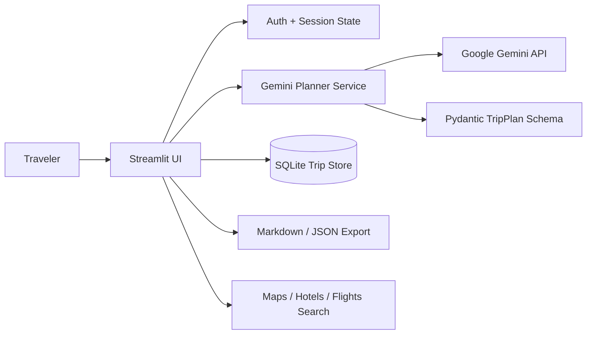

# 🧭 RouteMatrix — AI Travel Itinerary & Trip Planning System

[](https://github.com/YashAgarwal-31/RouteMatrix-AI-Travel-Itinerary-Planner/actions/workflows/ci.yml)


RouteMatrix is a **production-oriented AI travel planning system** that turns a travel brief into a structured, budget-aware, day-by-day itinerary. It combines a Streamlit workspace, Google Gemini structured generation, persistent user accounts and saved trips, practical budget planning, map/search shortcuts, downloadable itinerary exports, and automated CI checks.

Instead of returning an unstructured wall of AI text, RouteMatrix validates Gemini output against typed Pydantic models so the UI can reliably render days, activities, estimated costs, recommendations, transport guidance, packing lists, safety notes, and trip assumptions.

> **Status:** application code is deployment-ready for portfolio/demo use. Before sharing a public live URL, add `GEMINI_API_KEY` through provider secrets and complete the smoke test in [`DEPLOYMENT.md`](./DEPLOYMENT.md).

## ✨ Product Highlights

- 🔐 **User accounts** with salted `scrypt` password hashing
- 💾 **Saved itineraries** with user-scoped SQLite persistence
- 🤖 **Gemini-powered structured itinerary generation** using Pydantic schemas
- 🗓️ **Day-by-day planning** with time slots, neighborhoods, activities, costs, map queries, and tips
- 💰 **Budget-aware planning** with category breakdown and budget-fit status
- 🏨 **Stay recommendations** by area/type without pretending to have live availability
- 🍽️ **Food recommendations** aligned with dietary preferences
- 🚇 **Local transport guidance** based on trip style and constraints
- ♿ **Accessibility-aware planning** when accessibility needs are supplied
- 🎒 **Packing, safety, local, and sustainability guidance**
- 🗺️ **Google Maps / Hotels / Flights search shortcuts** for live verification
- 📥 **Markdown and JSON itinerary exports**
- ✅ **Input validation, schema validation, error states, tests, linting, and CI**
- 🔑 **Environment / Streamlit secrets support** — no API keys in source code

## 📸 Application Preview


> The screenshot above is from the original RouteMatrix prototype. The current codebase has been restructured into a full application architecture with authentication, persistence, structured AI output, exports, tests, and deployment support.

## 🧠 How It Works

1. A user creates an account or signs in.
2. The planner collects destination, dates, travelers, budget, currency, pace, interests, accommodation, food preferences, transport preferences, accessibility needs, and custom notes.
3. RouteMatrix builds a guarded travel-planning prompt.
4. Gemini generates a response constrained to the `TripPlan` Pydantic schema.
5. RouteMatrix validates and renders the itinerary into separate day, budget, stay/food, travel-note, and export views.
6. The itinerary is saved to the authenticated user's trip history.
7. Users can reopen, export, or delete saved plans and use external live-search shortcuts before booking.

## 🏗️ Architecture



### Project structure

```text
.
├── app.py
├── routematrix/
│   ├── ai.py             # Gemini structured-generation service
│   ├── auth.py           # scrypt password hashing
│   ├── config.py         # environment / Streamlit secrets
│   ├── database.py       # user + trip persistence
│   ├── exporters.py      # Markdown / JSON export utilities
│   ├── models.py         # Pydantic request / itinerary schemas
│   └── ui.py             # reusable Streamlit UI/rendering
├── tests/
├── .github/workflows/ci.yml
├── .streamlit/config.toml
├── requirements.txt
├── requirements-dev.txt
├── .env.example
├── DEPLOYMENT.md
└── README.md
```

## 🧳 Planner Inputs

RouteMatrix can plan around:

- Destination and starting city
- Start/end dates
- Number of travelers
- Total budget and currency
- Relaxed, balanced, or fast-paced travel style
- Culture, food, nature, adventure, beaches, nightlife, photography, museums, wellness, family activities, hidden gems, and more
- Accommodation preference
- Dietary requirements
- Transport preferences
- Accessibility needs
- Must-see places and custom constraints

A single generated trip is capped by `MAX_TRIP_DAYS` (21 by default) to keep AI output focused and reviewable.

## 🤖 Structured AI Output

The AI returns a typed `TripPlan` containing:

- Trip title and overview
- Estimated total cost and budget-fit classification
- Budget breakdown by category
- Daily itinerary with activity times and descriptions
- Estimated activity and daily costs
- Booking guidance and map-search queries
- Stay and food recommendations
- Transport suggestions
- Packing list
- Local tips
- Safety notes
- Sustainability suggestions
- Assumptions and live-data disclaimer

RouteMatrix intentionally does **not** claim real-time prices, weather, visa approval, opening hours, or availability. Users are directed to verify live data before booking.

## 🧰 Tech Stack

| Layer | Technology |
|---|---|
| Language | Python 3.12 |
| UI | Streamlit |
| Generative AI | Google Gemini API via `google-genai` |
| Structured output | Pydantic |
| Persistence | SQLite |
| Data display | Pandas |
| Secrets | Environment variables / Streamlit Secrets |
| Security | `hashlib.scrypt` + random salts |
| Testing | Pytest |
| Linting | Ruff |
| CI | GitHub Actions |

## 🚀 Local Development

### 1. Clone

```bash
git clone https://github.com/YashAgarwal-31/RouteMatrix-AI-Travel-Itinerary-Planner.git
cd RouteMatrix-AI-Travel-Itinerary-Planner
```

### 2. Create a virtual environment

```bash
python -m venv .venv
```

Activate it, then install dependencies:

```bash
pip install -r requirements.txt
```

### 3. Configure Gemini

```bash
cp .env.example .env
```

Set:

```text
GEMINI_API_KEY=your_gemini_api_key
```

You can also use `.streamlit/secrets.toml` locally or provider-managed Streamlit secrets when deployed. Never commit real keys.

### 4. Run

```bash
streamlit run app.py
```

Open `http://localhost:8501`.

## 🧪 Quality Gate

GitHub Actions runs on `main`, feature branches, and pull requests:

```bash
pip install -r requirements-dev.txt
ruff check .
python -m pytest
python -m compileall -q app.py routematrix
```

Tests cover password hashing, authentication, user/trip persistence, model behavior, map URL generation, and itinerary exports.

## 🔒 Security & Reliability

- Gemini API keys are read from environment variables or Streamlit Secrets.
- `.env`, `secrets.toml`, SQLite files, virtual environments, and caches are ignored by Git.
- Passwords are never stored in plaintext; RouteMatrix uses salted `scrypt` hashes.
- Database queries use parameterized SQLite statements.
- User trip lookups are scoped by authenticated user ID.
- Gemini output is schema-validated before rendering or persistence.
- The AI prompt treats user text as preferences rather than privileged system instructions.
- Generated prices and travel information are labeled as estimates/planning guidance.

## ☁️ Deployment

See [`DEPLOYMENT.md`](./DEPLOYMENT.md) for Streamlit Community Cloud setup, secrets configuration, persistence limitations, and the live smoke-test checklist.

The included SQLite persistence is appropriate for local development, portfolio demos, and a single app instance. For a larger public SaaS, move authentication/persistence to a managed database and identity layer, add observability/rate limits, and perform load testing.

## 📌 Portfolio Scope

RouteMatrix is designed to demonstrate practical AI engineering rather than just API calling: structured LLM output, input validation, secure secret handling, authentication, persistence, modular architecture, exports, tests, CI, and deployment-aware system design are all part of the project.

---

Built as a full AI travel-planning system with Python, Streamlit, Google Gemini, Pydantic, SQLite, and production-oriented engineering practices.
