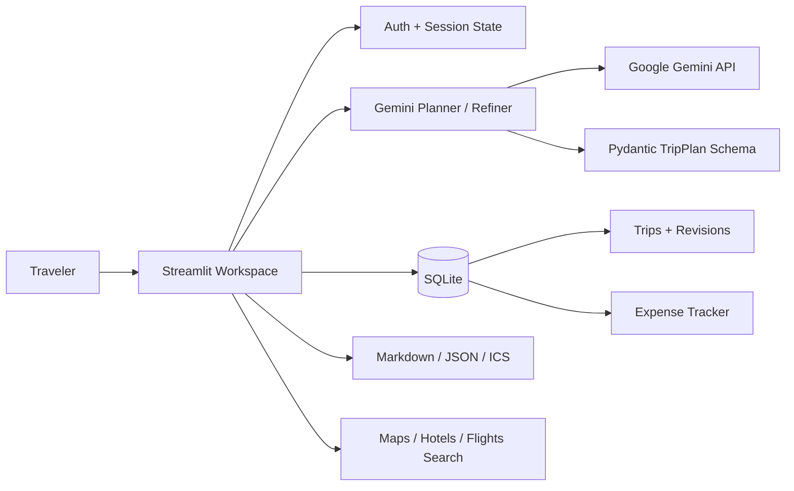

# 🧭 RouteMatrix — AI Travel Itinerary & Trip Planning System

[](https://github.com/YashAgarwal-31/RouteMatrix-AI-Travel-Itinerary-Planner/actions/workflows/ci.yml)


RouteMatrix is a **production-oriented AI travel planning workspace** that turns a travel brief into a structured, budget-aware, day-by-day itinerary and then helps the traveler keep improving and managing that trip. It combines Google Gemini structured generation, authenticated saved trips, AI itinerary refinement with version history, practical budget planning, actual-expense tracking, travel search shortcuts, calendar/Markdown/JSON exports, tests, and CI.

Instead of returning an unstructured wall of AI text, RouteMatrix validates Gemini output against typed Pydantic models so the application can reliably render dates, activities, estimated costs, stay/food recommendations, transport guidance, packing lists, safety notes, sustainability guidance, and trip assumptions.

> **Status:** application code is deployment-ready for portfolio/demo use. Before sharing a public live URL, add `GEMINI_API_KEY` through provider secrets and complete the live smoke test in [`DEPLOYMENT.md`](./DEPLOYMENT.md).

## ✨ Product Highlights

- 🔐 **User accounts** with salted `scrypt` password hashing
- 💾 **User-scoped saved trips** with SQLite persistence
- 🤖 **Gemini-powered structured itinerary generation** using Pydantic schemas
- ✨ **AI itinerary refinement** — ask RouteMatrix to lower cost, slow the pace, swap activities, or add constraints
- 🕘 **Itinerary version history** with restore support so AI edits are reversible
- 🗓️ **Day-by-day planning** with time slots, neighborhoods, activities, estimated costs, booking flags, map queries, and practical tips
- 💰 **Budget-aware planning** with category breakdown and budget-fit status
- 💳 **Actual expense tracker** with planned-vs-recorded budget visibility
- 🏨 **Stay recommendations** by area/type without pretending to have live availability
- 🍽️ **Food recommendations** aligned with dietary preferences
- 🚇 **Local transport guidance** based on trip style and constraints
- ♿ **Accessibility-aware planning** when accessibility needs are supplied
- 🎒 **Packing, safety, local, and sustainability guidance**
- 🗺️ **Google Maps / Hotels / Flights search shortcuts** for live verification
- 📥 **Markdown, JSON, and `.ics` calendar exports**
- ✅ **Input validation, schema validation, safe failure states, tests, linting, compile checks, and CI**
- 🔑 **Environment / Streamlit secrets support** — no API keys in source code

## 📸 Application Preview


> The screenshot above is from the original RouteMatrix prototype. The current codebase has been rebuilt into a modular application with authentication, persistent saved trips, structured AI output, itinerary refinement/versioning, expense tracking, exports, tests, CI, and deployment support. A fresh production screenshot should replace this after deployment.

## 🧠 How It Works

1. A traveler creates an account or signs in.
2. The planner collects destination, dates, travelers, budget, currency, pace, interests, accommodation, food preferences, transport preferences, accessibility needs, and custom notes.
3. RouteMatrix builds a guarded travel-planning prompt while treating user text as preferences rather than privileged system instructions.
4. Gemini generates a response constrained to the typed `TripPlan` Pydantic schema.
5. RouteMatrix validates the response and renders day-by-day planning, budget, stay/food, travel notes, and export views.
6. The itinerary is saved to the authenticated user's trip history as revision 1.
7. The traveler can request natural-language AI refinements; every accepted update becomes a new reversible itinerary revision.
8. The traveler can track real expenses against the planned budget, reopen trips, export them to Markdown/JSON/calendar, or use external live-search shortcuts before booking.

## 🏗️ Architecture



### Project structure

```text
.
├── app.py
├── routematrix/
│   ├── ai.py             # Gemini generation + refinement service
│   ├── auth.py           # salted scrypt password hashing
│   ├── config.py         # environment / Streamlit secrets
│   ├── database.py       # users, trips, revisions, expenses
│   ├── exporters.py      # Markdown / JSON / ICS export utilities
│   ├── models.py         # Pydantic request / itinerary schemas
│   └── ui.py             # reusable Streamlit UI/rendering
├── tests/
├── .github/workflows/ci.yml
├── .streamlit/config.toml
├── requirements.txt
├── requirements-dev.txt
├── .env.example
├── DEPLOYMENT.md
└── README.md
```

## 🧳 Planner Inputs

RouteMatrix can plan around:

- Destination and starting city
- Start/end dates
- Number of travelers
- Total budget and currency
- Relaxed, balanced, or fast-paced travel style
- Culture, food, nature, adventure, beaches, nightlife, photography, museums, wellness, family activities, hidden gems, and more
- Accommodation preference
- Dietary requirements
- Transport preferences
- Accessibility needs
- Must-see places and custom constraints

A single generated trip is capped by `MAX_TRIP_DAYS` (21 by default) to keep AI output focused and reviewable.

## 🤖 Structured AI Planning

Gemini returns a typed `TripPlan` containing:

- Trip title and overview
- Estimated total cost and budget-fit classification
- Budget breakdown by category
- Daily itinerary with activity times and descriptions
- Estimated activity and daily costs
- Booking guidance and map-search queries
- Stay and food recommendations
- Transport suggestions
- Packing list
- Local tips
- Safety notes
- Sustainability suggestions
- Assumptions and live-data disclaimer

The generation path verifies that the model returns exactly the requested number of trip days before the plan is persisted.

## ✨ AI Refinement & Versioning

Saved trips are not one-shot outputs. A traveler can ask RouteMatrix to make changes such as:

- “Make Day 2 less rushed.”
- “Keep the whole trip under 80,000 INR.”
- “Replace nightlife with family-friendly activities.”
- “Add vegetarian meal options throughout.”
- “Reduce walking and make the trip senior-friendly.”

Gemini receives the original trip constraints plus the current structured itinerary and must return a complete replacement `TripPlan`. Each successful refinement is stored as a new revision. Earlier versions remain available and can be restored without losing history.

## 💳 Budget & Expense Tracking

RouteMatrix separates **planned cost** from **actual recorded spend**:

- Planned trip budget from the user's request
- AI-estimated trip total and category breakdown
- Actual expenses by date/category/description
- Recorded spend and remaining budget metrics
- User-scoped expense creation and deletion

The tracker uses the itinerary currency and is meant for trip organization, not financial/accounting use.

## 📥 Exports

Every itinerary can be downloaded as:

- **Markdown** — readable/shareable trip document
- **JSON** — structured data for integrations or further processing
- **ICS calendar** — itinerary activities as calendar events

Activity map queries also link to Google Maps search, while destination-level shortcuts open Google Hotels and Google Flights/Travel so the traveler can verify current information externally.

## ⚠️ Live Data Boundary

RouteMatrix intentionally does **not** claim real-time prices, current weather, visa approval, opening hours, transport disruptions, or hotel/flight availability. AI-generated costs are estimates. Live information must be verified with the relevant provider before booking or travel.

This design keeps the portfolio project technically honest while still demonstrating end-to-end AI product engineering.

## 🧰 Tech Stack

| Layer | Technology |
|---|---|
| Language | Python 3.12 |
| UI | Streamlit |
| Generative AI | Google Gemini API via `google-genai` |
| Structured output | Pydantic |
| Persistence | SQLite |
| Data display | Pandas |
| Secrets | Environment variables / Streamlit Secrets |
| Security | `hashlib.scrypt` + random salts |
| Testing | Pytest |
| Linting | Ruff |
| CI | GitHub Actions |

## 🚀 Local Development

### 1. Clone

```bash
git clone https://github.com/YashAgarwal-31/RouteMatrix-AI-Travel-Itinerary-Planner.git
cd RouteMatrix-AI-Travel-Itinerary-Planner
```

### 2. Create a virtual environment

```bash
python -m venv .venv
```

Activate it, then install dependencies:

```bash
pip install -r requirements.txt
```

### 3. Configure Gemini

```bash
cp .env.example .env
```

Set:

```text
GEMINI_API_KEY=your_gemini_api_key
```

You can also use `.streamlit/secrets.toml` locally or provider-managed Streamlit secrets when deployed. Never commit real keys.

### 4. Run

```bash
streamlit run app.py
```

Open `http://localhost:8501`.

## 🧪 Quality Gate

GitHub Actions runs on `main`, feature branches, and pull requests:

```bash
pip install -r requirements-dev.txt
ruff check .
python -m pytest
python -m compileall -q app.py routematrix
```

Tests cover password hashing, authentication, user isolation, trip persistence, itinerary revision/restore behavior, expense persistence, model/date validation, Gemini SDK structured-output configuration, generation/refinement prompt contracts, map URL generation, Markdown export, and ICS calendar export.

## 🔒 Security & Reliability

- Gemini API keys are read from environment variables or Streamlit Secrets.
- `.env`, `secrets.toml`, SQLite files, virtual environments, and caches are ignored by Git.
- Passwords are never stored in plaintext; RouteMatrix uses salted `scrypt` hashes.
- Database queries use parameterized SQLite statements.
- Trip, revision, and expense operations are scoped by authenticated user ID.
- Gemini output is schema-validated before rendering or persistence.
- The AI system instruction treats user text as preferences rather than privileged instructions.
- Failed AI generation/refinement leaves the currently saved trip unchanged.
- Generated prices and travel information are explicitly labeled as estimates/planning guidance.

## ☁️ Deployment

See [`DEPLOYMENT.md`](./DEPLOYMENT.md) for Streamlit Community Cloud setup, secrets configuration, persistence limitations, and the live smoke-test checklist.

The included SQLite persistence is appropriate for local development, portfolio demos, and a single app instance with persistent storage. For a larger public SaaS, move authentication/persistence to a managed database and identity layer, add observability/rate limits, external live-data providers where licensed, and perform load testing.

## 📌 Portfolio Scope

RouteMatrix is designed to demonstrate practical AI engineering rather than just an API call. The repository includes structured LLM output, iterative AI refinement, versioned state, input validation, secret handling, authentication, persistence, expense management, exports, tests, CI, and deployment-aware system design.

---

Built as a full AI travel-planning workspace with Python, Streamlit, Google Gemini, Pydantic, SQLite, and production-oriented engineering practices.
